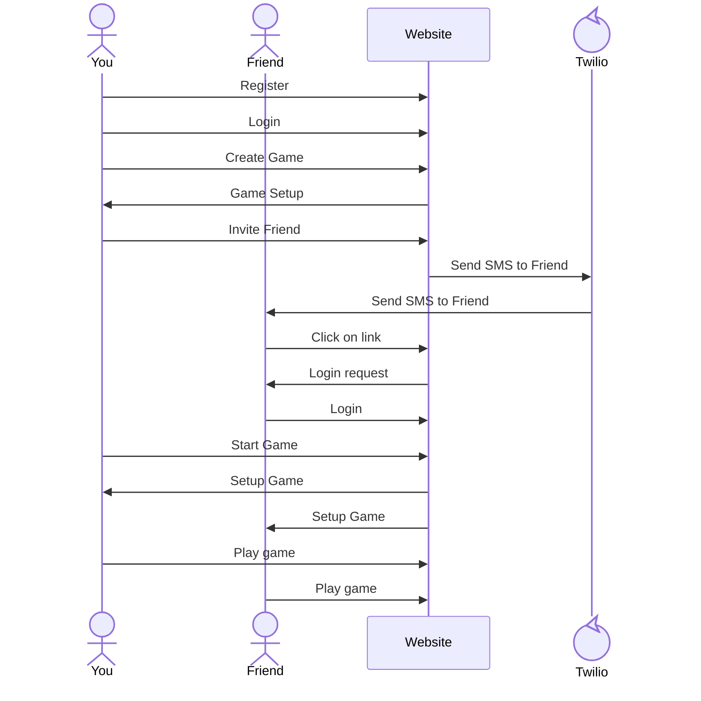

# Ticket-to-Ride Open Source

[My Notes](notes.md)

This is a recreation of Ticket-to-Ride, a turn based board game that plays 2 to 5 players.

> [!NOTE]
> This is an educational GitHub project for learning Web Development, and is not affiliated in any way with [Ticket To Ride, as published by Days of Wonder](https://www.daysofwonder.com/universe/ticket-to-ride/) and is NOT intended for commercial use. Images like the GitHub logos or the train map itself may be the intellectual property of other organizations, and are not my right to give. I believe that use of materials like the map falls under fair use given the purpose of this project.

### Elevator pitch

Sometimes I want to play Ticket-to-Ride with friends, but I can't because I do not have a physical board. Imagine if I could play it online on my phone! Then, you would not have to deal with pieces falling everywhere or counting trains remaining per player, or handle scoring over time (which is a pain). The game could be more competitive because a current vp score would exist for each player, making leaders clearer.

### Design

Lorem ipsum dolor sit amet, consectetur adipiscing elit, sed do eiusmod tempor incididunt ut labore et dolore magna aliqua. Ut enim ad minim veniam, quis nostrud exercitation ullamco laboris nisi ut aliquip ex ea commodo consequat. Duis aute irure dolor in reprehenderit in voluptate velit esse cillum dolore eu fugiat nulla pariatur. Excepteur sint occaecat cupidatat non proident, sunt in culpa qui officia deserunt mollit anim id est laborum.

### Key features

- Register, login, logout
- Be able to setup or join a game
- Be able to invite friends to join the game
- Play Ticket-to-Ride with processing done on the backend
  - MVP All game logic, determining winners, etc. should be correct.
  - MVP hopefully is the base US map, although that may be cut down
  - Potential reach goal of randomly generated maps + routes.
- See global stats for players
  - Number of games played is MVP
  - All other stats are extra

### Technologies

I am going to use the required technologies in the following ways.

- **HTML** - This will be used to design each page in terms of looks. The one complicated aspect will be designing the look of the board itself, with its asymmetric custom style.
- **CSS** - This will format the components to have a common style, color format, etc. If I had more time, I would have a style guide which CSS would implement, but CSS will be the style guide in this case.
- **React** - This will power the front-end, running the components and running api requests to the server. It will transition between screens, and also
- **Service** - Backend service. Endpoints will follow the latest version of OpenAPI, [OpenAPI v3.2](https://spec.openapis.org/oas/latest.html)
  - endpoint for creating game
  - endpoint for joining game
  - endpoint for inviting friends to game
  - endpoints for playing moves
    - selecting train tickets
    - selecting train cards
    - playing trains
  - endpoint for registering account
    - Accounts may be based on phone number or email address, not sure
      - This could also be the 3rd party API.
      - MVP will be a local account, no solution like linking to gmail.
  - endpoint for logging in.
  - endpoint to see global stats
    - most games played by person
    - win/loss percentages by player
    - leaderboard
  - may need endpoint for logging out, not sure.
  - Inviting users to play a game will involve a text message through Twilio, which is the 3rd party api. The [MockAPI](https://www.twilio.com/docs/openapi/mock-api-generation-with-twilio-openapi-spec) will be used to ensure it works, then the Mock will be adjusted to have text necessary to play the game, then Twilio will actually be used.
    - Notably, this will likely need to have the invited person create an account or something of the like. I am not sure though.
    - MVP may be that invited players are given accounts with default passwords? Not sure.
- **DB/Login** - There will be a username and password for accounts to play. Game state and hidden information will be stored on the backend servers, and Mongo DB will be used to allow for multiple games to be run simaltaneously throughout the globe, where if one server goes down, others can still work (Consistent and Partition Tolerance).
- **WebSocket** - Live notifications that it is your turn.

## 🚀 Specification Deliverable

> [!NOTE]
> Fill in this sections as the submission artifact for this deliverable. You can refer to this [example](https://github.com/webprogramming260/startup-example/blob/main/README.md) for inspiration.

For this deliverable I did the following. I checked the box `[x]` and added a description for things I completed.

- [x] I completed the prerequisites for this deliverable (Git commit requirement)
- [x] Proper use of Markdown
- [x] A concise and compelling elevator pitch
- [x] Description of key features
- [x] Description of how you will use each technology
- [ ] One or more rough sketches of your application. Images must be embedded in this file using Markdown image references.

## 🚀 AWS deliverable

For this deliverable I did the following. I checked the box `[x]` and added a description for things I completed.

- [x] **Rented EC2 server** - The EC2 server is rented.
- [x] **Leased domain name** - I have a T3 server on AWS working.
- [x] **Server accessible** from my domain: [https://kimball.click](https://kimball.click) - The server is running now.

## 🚀 HTML deliverable

For this deliverable I did the following. I checked the box `[x]` and added a description for things I completed.

- [x] I completed the prerequisites for this deliverable (Simon deployed, GitHub link, Git commits) - the GitHub link is in a footer accross pages. Simon is deployed, there are multiple git commits.
- [x] **HTML pages** - All general pages added. May need more in the future, but basic start created.
- [x] **Proper HTML element usage** - It looks generally good.
- [x] **Links** - Links exist between setup, play, leaderboard, and index.
- [x] **Text** - Textual Content added for pages.
- [x] **3rd party API placeholder** - Placeholder for inviting friends via Twilio in setup.html
- [x] **Images** - PNGs of train cards added to play.html. More images will ultimately be needed.
- [x] **Login placeholder** - found on index.html. I will need to decide if an email or phone number is better ultimately.
- [x] **DB data placeholder** - Basic database calls for leaderboard info added.
- [x] **WebSocket placeholder** - Placeholder for notifications on when a player joined in a game in waiting room, or when it is your turn added.

## 🚀 CSS deliverable

For this deliverable I did the following. I checked the box `[x]` and added a description for things I completed.

- [x] I completed the prerequisites for this deliverable (Simon deployed, GitHub link, Git commits)
- [x] **Visually appealing colors and layout. No overflowing elements.** - Added an earthy Ticket-to-Ride inspired visual style with card-based sections and responsive table containers to avoid overflow on phones.
- [x] **Use of a CSS framework** - Added Tailwind CSS with CDN setup for this static phase.
- [x] **All visual elements styled using CSS** - Styled page chrome (header/footer/navigation), forms, tables, cards, notifications, and buttons across the startup pages.
- [x] **Responsive to window resizing using flexbox and/or grid display** - Implemented a mobile-first portrait layout with responsive utility classes, flex, and grid.
- [x] **Use of a imported font** - Added Nunito Sans from Google Fonts.
- [x] **Use of different types of selectors including element, class, ID, and pseudo selectors** - Existing semantic elements and IDs remain in use, with Tailwind class utilities and pseudo-class variants (hover/focus-visible) applied.

## 🚀 React part 1: Routing deliverable

For this deliverable I did the following. I checked the box `[x]` and added a description for things I completed.

- [x] I completed the prerequisites for this deliverable (Simon deployed, GitHub link, Git commits)
- [x] **Bundled using Vite** - Was bundled and deployed to startup.kimball.click.
- [x] **Components** - Pages were turned into components. Note that tailwind css was used (hence some differences), as well as typescript components (not javascript)
- [x] **Router** - Routing works as expected.

### React + TypeScript map pin model scaffold

A starter TypeScript domain model has been added for map route pins and train requirements. This is architecture only (not game logic), so a future React migration can render pins from typed snapshots.

- `src/domain/train-types.ts` - train color and card type definitions.
- `src/domain/train-requirement.ts` - fixed-color and any-color route requirement model.
- `src/domain/map-pin.ts` - pin object with percentage location, angle, slot-chain links, and neighbor links.
- `src/domain/route-link.ts` - route link model with ordered pin slots (2 to 3+ supported).
- `src/domain/board-pin-registry.ts` - container for route links and pins plus relationship wiring.
- `src/domain/index.ts` - barrel exports for easier future imports.

This model aligns with the current board overlay approach in play.html: x/y percentages and angle degrees for map placement.

## 🚀 React part 2: Reactivity deliverable

For this deliverable I did the following. I checked the box `[x]` and added a description for things I completed.

- [x] I completed the prerequisites for this deliverable (Simon deployed, GitHub link, Git commits)
- [x] **All functionality implemented or mocked out** - The play page is driven by a hook-backed local game state model, so the main gameplay loop, card draws, route claims, ticket selection, and turn/status updates are implemented or intentionally mocked in React.
- [x] **Hooks** - I moved the play page logic into `usePlayPageState` and use React hooks such as state, memoization, refs, and effects to manage the game UI reactively.

## 🚀 Service deliverable

For this deliverable I did the following. I checked the box `[x]` and added a description for things I completed.

- [ ] I completed the prerequisites for this deliverable (Simon deployed, GitHub link, Git commits)
- [ ] **Node.js/Express HTTP service** - I did not complete this part of the deliverable.
- [ ] **Static middleware for frontend** - I did not complete this part of the deliverable.
- [ ] **Calls to third party endpoints** - I did not complete this part of the deliverable.
- [ ] **Backend service endpoints** - I did not complete this part of the deliverable.
- [ ] **Frontend calls service endpoints** - I did not complete this part of the deliverable.
- [ ] **Supports registration, login, logout, and restricted endpoint** - I did not complete this part of the deliverable.
- [ ] **Uses BCrypt to hash passwords** - I did not complete this part of the deliverable.

## 🚀 DB deliverable

For this deliverable I did the following. I checked the box `[x]` and added a description for things I completed.

- [ ] I completed the prerequisites for this deliverable (Simon deployed, GitHub link, Git commits)
- [ ] **Stores data in MongoDB** - I did not complete this part of the deliverable.
- [ ] **Stores credentials in MongoDB** - I did not complete this part of the deliverable.

## 🚀 WebSocket deliverable

For this deliverable I did the following. I checked the box `[x]` and added a description for things I completed.

- [ ] I completed the prerequisites for this deliverable (Simon deployed, GitHub link, Git commits)
- [ ] **Backend listens for WebSocket connection** - I did not complete this part of the deliverable.
- [ ] **Frontend makes WebSocket connection** - I did not complete this part of the deliverable.
- [ ] **Data sent over WebSocket connection** - I did not complete this part of the deliverable.
- [ ] **WebSocket data displayed** - I did not complete this part of the deliverable.
- [ ] **Application is fully functional** - I did not complete this part of the deliverable.
